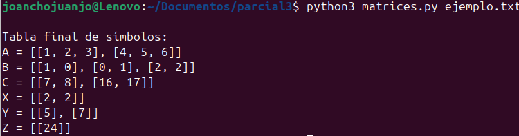

# PARCIAL3Lenguajes

### 1. Modele una función que genere una gramática de atributos para un lenguaje de programación que realice consultas de tipo SQL (CRUD)

#### Gramática 

```python
    ("CREAR", r"CREAR"),
    ("TABLA", r"TABLA"),
    ("INSERTAR", r"INSERTAR"),
    ("EN", r"EN"),
    ("VALORES", r"VALORES"),
    ("LEER", r"LEER"),
    ("DE", r"DE"),
    ("DONDE", r"DONDE"),
    ("ACTUALIZAR", r"ACTUALIZAR"),
    ("COLOCAR", r"COLOCAR"),
    ("ELIMINAR", r"ELIMINAR"),

    ("NUM", r"[0-9]+"),
    ("TEXTO", r"\"[^\"]*\""),
    ("IDENT", r"[a-zA-Z_][a-zA-Z0-9_]*"),

    ("COMA", r","),
    ("PARI", r"\("),
    ("PARD", r"\)"),
    ("IGUAL", r"="),

    ("WS", r"[ \t\r\n]+")
```

La gramática no solo define la sintaxis válida del lenguaje (las reglas para CREAR, INSERTAR, LEER, ACTUALIZAR y ELIMINAR), sino que también agrega acciones semánticas que se ejecutan mientras se analiza la entrada.

Cada operación activa una función que produce una traducción estructurada como create(tabla), insert(tabla, valores), read(tabla), etc., y además actualiza una tabla de símbolos, donde se registran las tablas creadas y sus columnas.

### Funcion

La gramática está en las funciones del parser.

Los atributos son los return y las actualizaciones de tabla_simbolos.

No existe una sola función que cree la gramática: la gramática está embebida en la estructura del parser completo.

#### Entrada

```python
INSERTAR EN usuarios VALORES (1,"Juan",20)
```

#### Salida


### 2. Diseñe una gramática para un lenguaje de programación que sea capaz de resolver el producto punto entre dos matrices de diferentes dimensiones.

```python

// --- Reglas principales ---
program
    : instruccion+ EOF
    ;

instruccion
    : declaracionMatriz
    | operacionProducto
    ;

// --- Declaración de matrices ---
declaracionMatriz
    : IDENT '=' 'MATRIX' '(' filas ')'
    ;

filas
    : fila (';' fila)*
    ;

fila
    : '[' listaValores ']'
    ;

listaValores
    : NUM (',' NUM)*
    ;

// --- Producto punto ---
operacionProducto
    : IDENT '=' 'DOTPRODUCT' '(' IDENT ',' IDENT ')'
    ;

// --- Tokens ---
NUM     : [0-9]+ ;
IDENT   : [a-zA-Z_][a-zA-Z0-9_]* ;

WS      : [ \t\r\n]+ -> skip ;
```

Declaración de matrices
Permite crear matrices usando la palabra clave MATRIX( … ).
Cada fila se escribe dentro de corchetes […], y las filas se separan con ;.


Operación de producto punto (DOTPRODUCT)
Permite asignar a una variable el resultado del producto entre dos matrices previamente declaradas.

### 3. Implemente en ANTLR la gramática del punto 2.

#### Visitor

```python
from MatrixProductVisitor import MatrixProductVisitor
from MatrixProductParser import MatrixProductParser

class EvalMatricesVisitor(MatrixProductVisitor):

    def __init__(self):
        self.tabla = {}   # tabla de símbolos

    # --- Declaración de matriz ---
    def visitDeclaracionMatriz(self, ctx: MatrixProductParser.DeclaracionMatrizContext):
        nombre = ctx.IDENT().getText()
        filas_ctx = ctx.filas()

        matriz = []
        for f in filas_ctx.fila():
            matriz.append(self.visit(f))

        self.tabla[nombre] = matriz
        return None

    def visitFila(self, ctx: MatrixProductParser.FilaContext):
        return [int(n.getText()) for n in ctx.listaValores().NUM()]

    # --- Operación DOTPRODUCT ---
    def visitOperacionProducto(self, ctx: MatrixProductParser.OperacionProductoContext):
        destino = ctx.IDENT(0).getText()
        Aname = ctx.IDENT(1).getText()
        Bname = ctx.IDENT(2).getText()

        if Aname not in self.tabla or Bname not in self.tabla:
            raise Exception("Error: una de las matrices no está definida.")

        A = self.tabla[Aname]
        B = self.tabla[Bname]

        # Dimensiones
        filasA = len(A)
        colsA = len(A[0])
        filasB = len(B)
        colsB = len(B[0])

        if colsA != filasB:
            raise Exception(
                f"No se puede hacer el producto: {Aname} es {filasA}x{colsA} y {Bname} es {filasB}x{colsB}"
            )

        # Producto punto
        C = []
        for i in range(filasA):
            fila = []
            for j in range(colsB):
                suma = 0
                for k in range(colsA):
                    suma += A[i][k] * B[k][j]
                fila.append(suma)
            C.append(fila)

        self.tabla[destino] = C
        return C

    # --- Programa completo ---
    def visitProgram(self, ctx: MatrixProductParser.ProgramContext):
        for inst in ctx.instruccion():
            self.visit(inst)
        return self.tabla
```
##### visitDeclaracionMatriz

Recorre las filas, los valores.

Convierte el texto en listas reales de Python.

Guarda la matriz en la tabla.

##### visitOperacionProducto

Busca A y B en la tabla.

Revisa que sus dimensiones permitan el producto.

Hace la multiplicación (con bucles).

Guarda el resultado como C.

##### visitProgram

Este método visita todas las instrucciones, una por una.
Sirve para que el programa entero se ejecute en orden.

#### Main

```python
import sys
from antlr4 import *
from MatrixProductLexer import MatrixProductLexer
from MatrixProductParser import MatrixProductParser
from EvalMatricesVisitor import EvalMatricesVisitor

def main():
    if len(sys.argv) != 2:
        print("Uso: python3 matrices.py archivo.txt")
        return

    input_stream = FileStream(sys.argv[1], encoding="utf-8")

    lexer = MatrixProductLexer(input_stream)
    tokens = CommonTokenStream(lexer)
    parser = MatrixProductParser(tokens)

    tree = parser.program()

    visitor = EvalMatricesVisitor()
    tabla = visitor.visit(tree)

    print("\nTabla final de símbolos:")
    for nombre, matriz in tabla.items():
        print(f"{nombre} = {matriz}")

if __name__ == "__main__":
    main()
```
#### Entrada
<pre>A = MATRIX([1,2,3]; [4,5,6])
B = MATRIX([1,0]; [0,1]; [2,2])
C = DOTPRODUCT(A, B)

X = MATRIX([2,2])
Y = MATRIX([5]; [7])
Z = DOTPRODUCT(X, Y)</pre>

#### Salida


