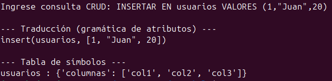

# PARCIAL3Lenguajes

### 1. Modele una función que genere una gramática de atributos para un lenguaje de programación que realice consultas de tipo SQL (CRUD)

#### Gramática 

```python
    ("CREAR", r"CREAR"),
    ("TABLA", r"TABLA"),
    ("INSERTAR", r"INSERTAR"),
    ("EN", r"EN"),
    ("VALORES", r"VALORES"),
    ("LEER", r"LEER"),
    ("DE", r"DE"),
    ("DONDE", r"DONDE"),
    ("ACTUALIZAR", r"ACTUALIZAR"),
    ("COLOCAR", r"COLOCAR"),
    ("ELIMINAR", r"ELIMINAR"),

    ("NUM", r"[0-9]+"),
    ("TEXTO", r"\"[^\"]*\""),
    ("IDENT", r"[a-zA-Z_][a-zA-Z0-9_]*"),

    ("COMA", r","),
    ("PARI", r"\("),
    ("PARD", r"\)"),
    ("IGUAL", r"="),

    ("WS", r"[ \t\r\n]+")
```

La gramática no solo define la sintaxis válida del lenguaje (las reglas para CREAR, INSERTAR, LEER, ACTUALIZAR y ELIMINAR), sino que también agrega acciones semánticas que se ejecutan mientras se analiza la entrada.

Cada operación activa una función que produce una traducción estructurada como create(tabla), insert(tabla, valores), read(tabla), etc., y además actualiza una tabla de símbolos, donde se registran las tablas creadas y sus columnas.

#### Entrada

```python
INSERTAR EN usuarios VALORES (1,"Juan",20)
```

#### Salida



### 2. Diseñe una gramática para un lenguaje de programación que sea capaz de resolver el producto punto entre dos matrices de diferentes dimensiones.
